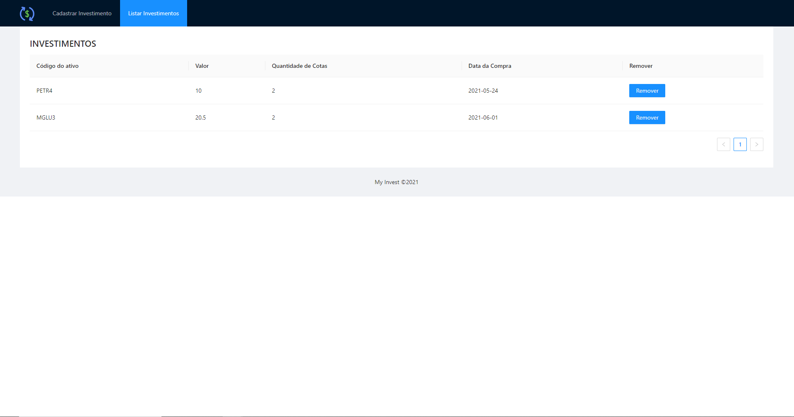
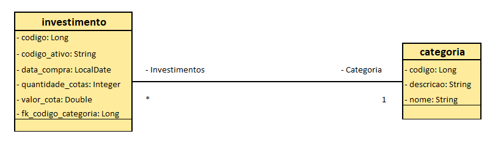

<h1 align="center">My Invest</h1>

  

## Project

My Invest is an investment control platform where the user can view all their investments, in addition to being able to remove investments that were sold and add the purchase of new investments.

## Technologies

This project was developed with the following technologies:

- [ReactJS](https://pt-br.reactjs.org/)
- [Ant Design](https://ant.design/)
- [Spring Boot](https://spring.io/projects/spring-boot)
- [PostgreSQL 12](https://www.postgresql.org/)

## Conceptual database model

  

## How to run

- Create a folder to workspace;
- Access the workspace folder;
- Clone the repository;
- Install the Java 11 in your machine;
- Verify if the Java 11's folder is registered in the System Variables in your machine;
- Install the STS IDE;
- Open the workspace folder in the STS IDE;
- Import the Back-end: File -> Import -> Maven -> Existing Maven Projects -> Browse.. -> access the cloned project folder and select `backend` folder -> Finish;
- Adjust database connection information in file: my-invest -> src/main/resources -> application.properties;
- Start the Back-end via the STS IDE;
- Back-end will run at `http://localhost:8080`;
- Access the cloned project folder;
- Access `frontend` directory;
- Install dependencies with `yarn`;
- Start the Front-end with `yarn start` or `npm start`;
- Front-end will run at `http://localhost:3000`;

## License

This project is under the MIT license. See the [LICENSE](LICENSE.md) file for more details.